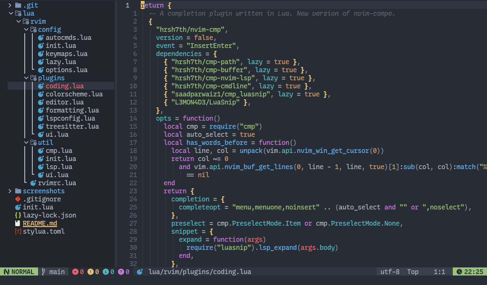
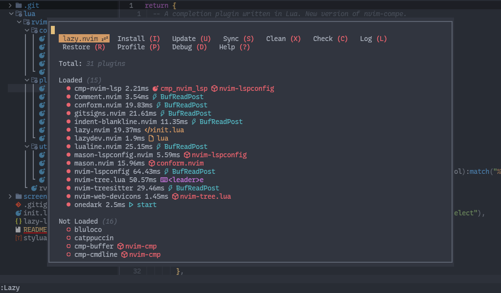

# :gear: Neovim

Hello! :wave: I present you my own Neovim configuration written entirely in Lua and this is an achievement for me since it cost me a lot to learn how to use this editor, since I had never used it before and I really like it :+1:.

I have learned by reading the [official documentation](https://neovim.io/doc/user/) :bookmark_tabs: and looking at configurations from other people who already know how to use it to see how they do it.

## :star2: Previews



## :zap: Requirements

- Neovim >= **0.8.0** (needs to be built with **LuaJIT**)
- Git >= **2.19.0** (for partial clones support)
- A Nerd Font (optional)

## :hammer_and_pick: Installation

#### Make a backup of your current nvim and shared folder

```bash
mv ~/.config/nvim ~/.config/nvim.bak
mv ~/.local/share/nvim ~/.local/share/nvim.bak
```

#### Clone the repository

```bash
git clone https://github.com/rosmerlopez24/neovim.git ~/.config/nvim
```

## :star: Credits
My sincere thanks and acknowledgements to the following repositories.

- [NvChad](https://github.com/NvChad/NvChad)
- [LazyVim](https://github.com/LazyVim/LazyVim)
- [LunarVim](https://github.com/LunarVim/LunarVim)
- [AstroVim](https://github.com/AstroNvim/AstroNvim)
- [Awesome Neovim](https://github.com/rockerBOO/awesome-neovim)
